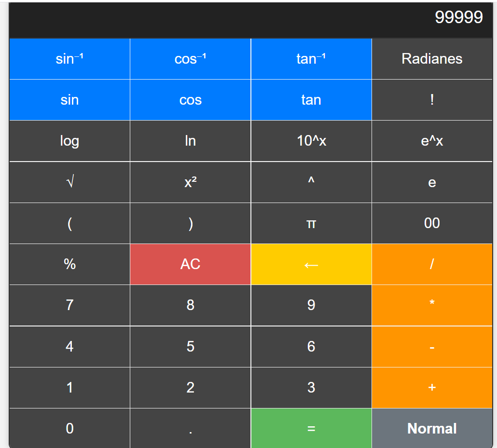

# Calculadora Científica

## Descripción

Este es un proyecto de calculadora científica desarrollada con HTML, CSS y JavaScript. La calculadora permite realizar cálculos matemáticos básicos y avanzados, como operaciones trigonométricas, logaritmos, factoriales y funciones exponenciales. El diseño es responsivo, lo que permite su uso en diferentes dispositivos.

## Características

- **Operaciones Básicas**: Suma, resta, multiplicación y división.
- **Funciones Científicas**: Calculadora incluye funciones como seno, coseno, tangente, logaritmos y exponenciales.
- **Soporte para Ángulos**: Posibilidad de alternar entre grados y radianes para funciones trigonométricas.
- **Historial de Cálculos**: Guarda el historial de operaciones realizadas.
- **Interfaz Amigable**: Diseño limpio y moderno, optimizado para dispositivos móviles y de escritorio.
- **Modo Científico y Normal**: Alternar entre el modo normal y el modo científico.

## Instalación

Para utilizar la calculadora, simplemente clona este repositorio en tu máquina local y abre el archivo `index.html` en tu navegador.

```bash
git clone https://github.com/tu-usuario/calculadora-cientifica.git
cd calculadora-cientifica
open index.html
```

## Uso

1. Abre el archivo `index.html` en un navegador.
2. Realiza operaciones matemáticas utilizando los botones o el teclado.
3. Alterna entre el modo normal y el modo científico usando el botón correspondiente.
4. Visualiza el historial de operaciones para repetir cálculos.

## Estructura de Archivos

```plaintext
calculadora-cientifica/
│
├── index.html          # Archivo principal de la aplicación
├── styles.css          # Estilos CSS para la calculadora
├── calculadora.js           # Lógica JavaScript de la calculadora
├── botones.js          # Botones de la calculadora
└── visual.png          # Captura de pantalla de la calculadora
```

## Captura de Pantalla



## Contribuciones

Las contribuciones son bienvenidas. Si deseas mejorar este proyecto, no dudes en hacer un fork y enviar un pull request.

## Licencia

Este proyecto está bajo la Licencia MIT. Para más detalles, consulta el archivo `LICENSE`.

### Personalización
1. **Título y Descripción**: Asegúrate de que el título del proyecto y la descripción sean adecuados para lo que has desarrollado.
2. **Instalación**: Cambia la URL del repositorio en la sección de instalación a la correcta si es necesario.
3. **Estructura de Archivos**: Asegúrate de que la estructura del archivo coincida con tu proyecto real. 
4. **Contribuciones y Licencia**: Actualiza estos apartados según sea necesario.